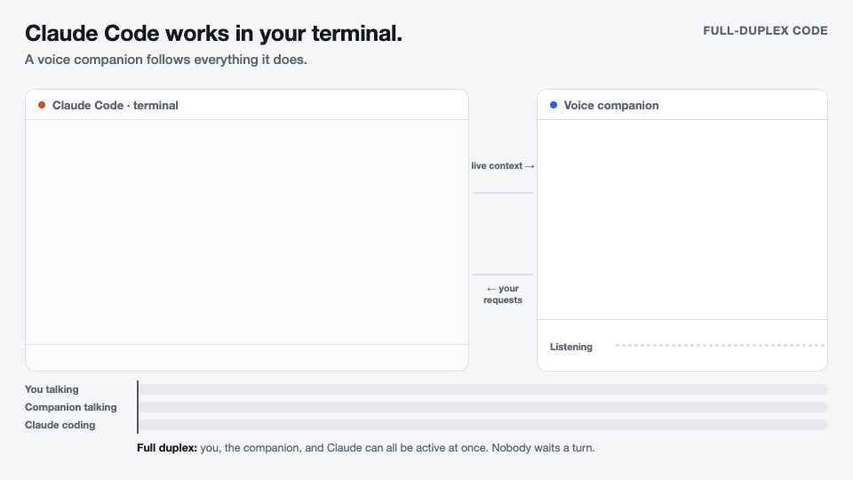
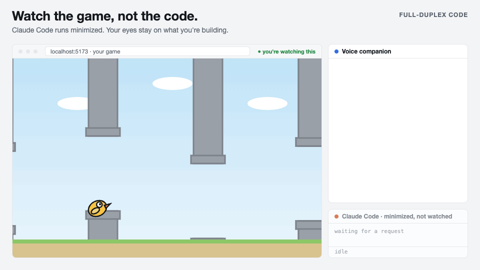

# Full-Duplex Code

Talk to Claude Code while it works. A voice companion powered by GPT Live 1 listens, speaks, and follows your coding session. Keep using the normal Claude terminal, including typing directly into it.



Ask for a change, ask what just happened, or change direction while Claude is working. The companion follows Claude’s messages, file edits, commands, and tool results automatically. It answers from that context and passes requests to Claude when more work is needed.

You don't have to watch the code or stay at your desk. Watch what you're building and say what you see. Or put in wireless earbuds and keep directing Claude from another room.



## Quick start

You'll need Node.js 22+, Claude Code installed and signed in, Chrome, a microphone, and an OpenAI API key with GPT Live 1 access. Tested on macOS.

```sh
git clone https://github.com/CakeCrusher/full_duplex_code.git
cd full_duplex_code
npm ci
```

Create a `.env` file in this folder with your key:

```dotenv
OPENAI_API_KEY=your-key-here
```

Start from this folder, using the path to your project:

```sh
npm start -- --cwd /path/to/your/project
```

Claude Code flags work here too. To skip its tool permission prompts:

```sh
npm start -- --cwd /path/to/your/project --dangerously-skip-permissions
```

1. Accept Claude's development-channel notice and any workspace trust prompt in the terminal.
2. In the browser companion, click **Start voice** and allow microphone access. If the page doesn't open, use the link printed in the terminal.
3. Start talking: “Ask Claude to add a dark mode.” You can also type into Claude and ask, “What did I just tell Claude?”

**End voice** stops the voice connection and its billing. Claude stays open. **Mute microphone** keeps the paid voice connection running.

To stop everything, type `/exit` in the Claude terminal and press Enter.

For setup details, resuming a session, costs, and troubleshooting, read the [user guide](USAGE.md). Run `npm run doctor` to check your setup, or `npm run usage` to check spending.
