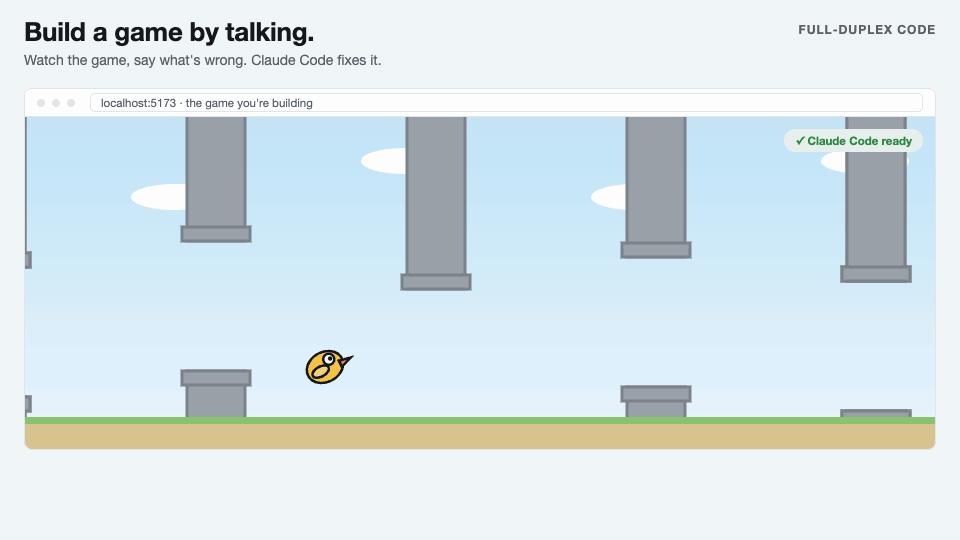
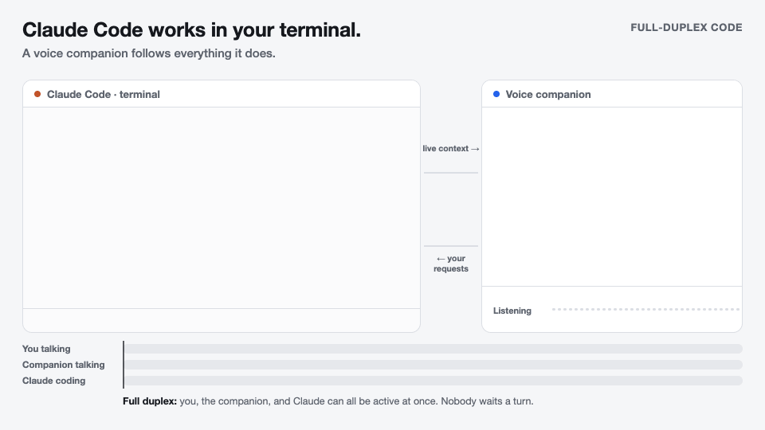

<p align="center">
  
</p>

<h1 align="center">Full-Duplex Code</h1>

<p align="center">Talk to Claude Code or Codex while it works.</p>

<p align="center"><a href="https://www.youtube.com/watch?v=mF8c93XIQw8">▶ Watch it in action: <b>I Coded From the Shower Without Looking at Claude Code</b></a></p>



Full-Duplex Code adds a voice companion to the coding agent you already use. The agent keeps its normal terminal, typing included. In the browser, a companion powered by GPT Live 1 follows what the agent does: its messages, edits, commands and tool results. It answers your questions from that, and passes your requests to the agent, even in the middle of a turn.

You don't have to stay at your desk. Hand off a task, go do something else, and keep talking to your agent from wherever you are: check in, change your mind, and hear when it's done.

## Quickstart

**You need** macOS (the tested setup), Node.js 22.18 or newer, Chrome, a microphone, Claude Code or Codex 0.155 or newer, installed and signed in, and an OpenAI API key with access to GPT Live 1.

### 1. Install

```sh
git clone https://github.com/CakeCrusher/full_duplex_code.git
cd full_duplex_code
npm ci
npm link                                    # puts the fdc command on your PATH
echo 'OPENAI_API_KEY=your-key-here' >> .env
fdc doctor                                  # checks the setup; spends nothing
```

### 2. Start your agent through `fdc`

In your project's folder, put `fdc` in front of the command you normally run. Everything after the agent's name reaches it unchanged.

```sh
cd /path/to/your/project
fdc claude          # or: fdc claude --dangerously-skip-permissions
fdc codex           # or: fdc codex --model gpt-5.5
```

### 3. Connect and talk

1. Open the link `fdc` prints in Chrome.
2. Press Enter in the terminal to start the agent. Claude Code asks you to confirm its development channel; choose **I am using this for local development**.
3. Click **Start voice** and allow the microphone.
4. Talk: "Ask Claude to add a dark mode." "What is it doing right now?" "Actually, use SQLite."

You can keep typing to the agent too, and ask the companion about it: "What did I just tell Claude?"

### 4. Stop

- **End voice** closes the voice connection and its billing, about $0.05 a minute. The agent keeps working.
- Exiting the agent stops everything: `/exit` in Claude Code, Ctrl-C twice in Codex.

## From your phone

Install [cloudflared](https://developers.cloudflare.com/cloudflare-one/connections/connect-networks/downloads/) once (`brew install cloudflared`), then add `--public`:

```sh
fdc --public claude
```

The launcher prints a phone link and a QR code once the link works. Open the page on your computer and your phone, in any order. Voice runs in one of them, and **Move voice here** brings it to the other. Keep the link private: anyone who has it can direct your agent.

## Everyday commands

| Command | What it does |
| --- | --- |
| `fdc claude --resume SESSION_ID` | Resume a Claude Code conversation |
| `fdc codex resume SESSION_ID` | Resume a Codex session |
| `fdc --public codex` | Also reach the companion from your phone |
| `fdc --voice cedar claude` | Pick the GPT Live voice (default `marin`) |
| `fdc doctor` | Check the setup without API spending |
| `fdc usage` | Show recorded voice usage and its cost |
| `fdc --help` | All options |

## How it works



- `fdc` starts a small bridge on this computer, then your agent's own command in the terminal.
- The agent's hooks report what it does. The bridge turns that into context for GPT Live.
- Your voice goes from the browser straight to OpenAI. Requests reach the agent through Claude Code's channel or Codex's app server, even mid-turn.

## Learn more

- [User guide](USAGE.md): the page and its timeline, what the companion follows, resuming, costs and troubleshooting.
- [Contributing](CONTRIBUTING.md): support another coding agent, and how changes are reviewed.

## License

[PolyForm Noncommercial 1.0.0](LICENSE): free for noncommercial use; commercial use is not granted. Built by [Sebastian Sosa](https://github.com/CakeCrusher) ([Noemica](https://noemica.io)).
